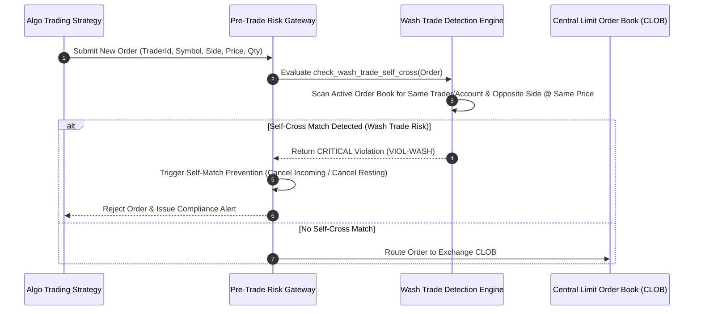

# Institutional Market Abuse Surveillance Workflows

## Workflow 1: Real-Time Wash Trade Self-Match Prevention (SMP)


---

## Workflow 2: Spoofing & Layering Post-Trade Analysis Pipeline
```mermaid
flowchart TD
    A[Ingest Order Fill Event] --> B[Retrieve Trader Event Log History]
    
    B --> C[Scan for Opposite-Side Cancellations within 1,000 ms Window]
    C --> D{Opposite-Side Cancellations Found?}
    
    D -- No --> E[Mark Fill as Compliant & Update Metrics]
    D -- Yes --> F[Calculate Canceled Volume & Average Order Lifespan]
    
    F --> G{Canceled Order Lifespan < 1,000 ms?}
    
    G -- Yes --> H[Generate CRITICAL Spoofing / Layering Violation Alert]
    G -- No --> I[Log Warning for Compliance Review]
    
    H --> J[Notify Compliance Officer & Trigger Algorithmic Execution Pause]
```
