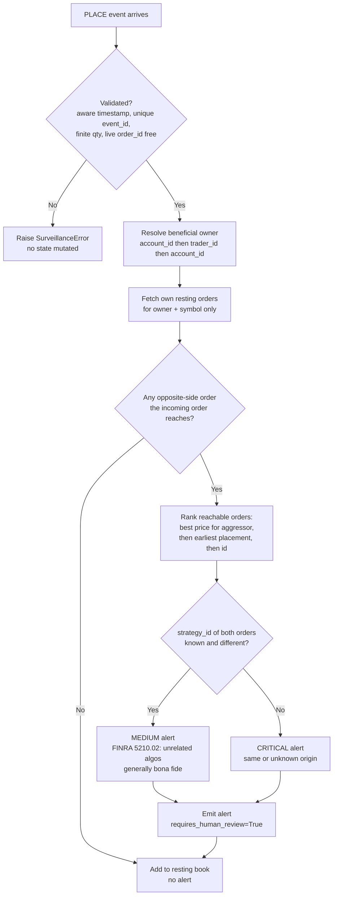
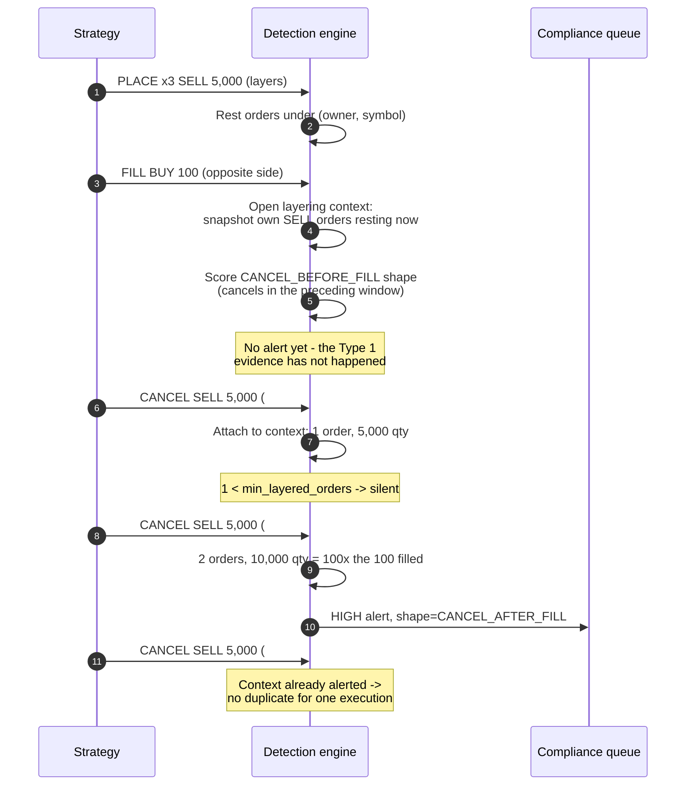
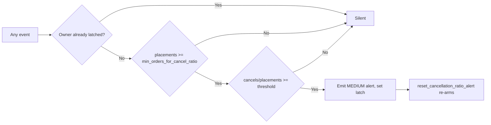

# Workflows — wash-trade-and-spoofing-self-detection

## Workflow 1: Self-match screening on order entry

The test is whether the incoming order **would match** the firm's own resting order — a
crossing test. Price equality is the special case, not the condition.

**Notes**

- The scan runs **before** the incoming order joins the book, so an order can never match
  itself, and the check is a pure query — calling it standalone as a pre-trade gate mutates
  nothing.
- Only the `(owner, symbol)` bucket is scanned, not the whole book.
- An unpriced order reaches every own level on the opposite side.
- The default `wash_trade_window_seconds=None` considers every resting order. A finite
  window models a narrow "matched trade" pattern and creates false negatives.
- The alert is an indicator. Intent — which CEA s.4c(a) turns on and which CME Rule 534
  tests as "knew or should have known" — is not in the order stream.

## Workflow 2: Layering detection across an execution

FINRA Rule 5210.03 Type 1 places the cancellations **after** the opposite-side execution.
The fill therefore cannot be scored when it arrives; a context is opened and settled by the
cancels that follow.

**The two tests that make this usable**

A two-sided market maker cancels opposite-side size around nearly every fill. Two
conjunctive tests separate quote maintenance from layering:

| Test | Default | Rationale |
|---|---|---|
| Count | $\ge 2$ withdrawn orders | Rule 5210.03 Type 1 describes *multiple* limit orders. |
| Size | withdrawn $\ge 3.0 \times$ executed | Layering's signature is displaying size far larger than the interest actually being executed. |

Withdrawing 200 around a fill of 100 is $2.0\times$ and stays silent; withdrawing 10,000
around a fill of 100 is $100\times$ and alerts.

**Boundaries**

- Only orders that were **resting at the moment of the fill** can attach — the "original
  limit orders" of the rule.
- Cancels on the **same** side as the execution never attach.
- Cancels outside `spoofing_lifespan_threshold_ms` never attach; the context is then pruned.
- One alert per execution. Further cancels against a settled context are silent.
- A single occurrence is an indicator. Rule 5210.03 defines disruptive activity as *a
  frequent pattern*, and CEA s.4c(a)(5)(C) requires scienter (78 FR 31890).

## Workflow 3: Cancellation-ratio hygiene

Counters are incremental, so this is O(1) per event rather than a rescan of history, and
the latch is what keeps one breach from producing one alert per subsequent event for the
rest of the session.

This ratio is cancels/placements. It is **not** the MiFID II RTS 9 order-to-trade ratio:
Delegated Regulation (EU) 2017/566 places that duty on the **trading venue**, computed per
member and per instrument on both volumes and numbers of orders.

## Workflow 4: Operating the engine

1. **Build the ownership map first.** Pull it from the firm's legal-entity/account
   reference data, not from the trading system. It is the single input that decides whether
   cross-account self-crossing is visible at all.
2. **Sequence the feed.** Layering contexts are pruned against the newest event timestamp,
   so a materially out-of-order feed must be sequenced upstream.
3. **Drain `alerts` and persist them with the parameters.** Store
   `beneficial_owner_map`, the thresholds, and the engine version alongside each alert so a
   decision can be reconstructed years later. Retention differs by jurisdiction: MiFID II
   RTS 6 Article 28 requires order records for five years; US broker-dealer retention runs
   on SEA Rule 17a-4 and FINRA Rule 4511(b).
4. **Route to a human.** Every alert carries `requires_human_review=True`. An automated
   detector cannot establish scienter or a frequent pattern, so it cannot conclude.
5. **Sweep stale state on session boundaries.** Call `expire_orders_before` with the
   venue's own end-of-day state — not a guess — for orders whose terminal event never
   arrived. A streaming engine that never hears the cancel would otherwise rest the order
   forever and keep alerting against it.
6. **Recalibrate on the false-positive rate you actually observe.** If the market-making
   desk generates a steady stream of layering alerts, `layering_size_ratio` is too low for
   that instrument — investigate before raising it, then record the reason.

## Workflow 5: Reconciling with the venue

The engine sees the firm's orders as the firm sent them. Two divergences matter:

| Divergence | What it means |
|---|---|
| The engine predicted a self-match that no print shows | The venue's SMP pulled one side, or the order was rejected, or the book moved first. Confirm SMP is configured — see `exchange-self-match-prevention-configuration`. |
| A self-match print with no engine alert | The engine's view of the resting book is incomplete: a missed event, an unmapped account, or a beneficial-ownership grouping that is too narrow. This is the failure worth chasing. |

CME's guidance treats SMP as a preventive tool rather than a defence, and it does not
operate during the Globex pre-open — so orders resting into the open must be de-conflicted
upstream, and this engine's audit trail is what evidences that they were.
