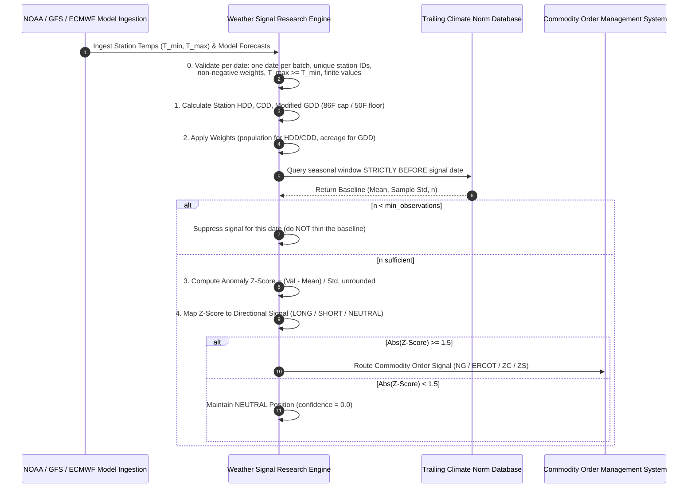
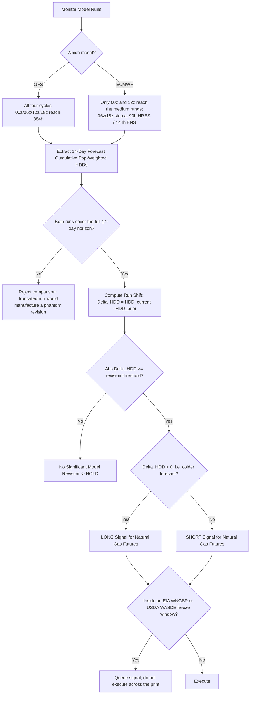

# Institutional Weather Data Signal Research Workflows

## Workflow 1: Weather Station Data & Model Forecast Processing Pipeline

### Look-ahead guard (step 3)
The baseline query is the single point where look-ahead bias enters a weather strategy. `compute_climate_baseline` filters on `entry_date < as_of` — strictly, not `<=` — and additionally bounds the sample to the seasonal window ($\pm$`day_window` calendar days of the target day-of-year, wrapping at the year boundary) and to `lookback_years` of history. Day-of-year matching maps every date onto a fixed non-leap reference year so a leap day does not shift the window by one.

The failure mode this prevents is subtle: computing $\mu$ and $\sigma$ once over the entire historical series (the natural pandas one-liner) embeds every future observation into the norm used to score the earliest dates, which inflates in-sample Sharpe and vanishes live.

---

## Workflow 2: GFS vs ECMWF Model Shift Arbitrage Pipeline

### Comparing like with like
Run-to-run deltas are only meaningful between runs of the **same model** covering the **same horizon**:

- **GFS**: all four daily cycles run to 16 days, so 00z-vs-06z, 06z-vs-12z, etc. are all valid 14-day comparisons.
- **ECMWF**: the 06z and 18z HRES/ENS cycles run only to 90 h and 144 h respectively. A 14-day cumulative HDD does not exist for them. Compare ECMWF **00z vs 12z** (or 12z vs the prior 00z) only.
- Never difference a GFS cumulative against an ECMWF cumulative and call it a revision — that is a model-disagreement measure, not a forecast shift.

### Revision threshold calibration
The threshold on $|\Delta \text{HDD}|$ is a calibrated parameter, not a constant: it depends on the region's weight vector, the horizon, and the season, and must be fitted on trailing data (10 gas-weighted HDDs is a materially larger revision in shoulder season than in January). Fit it with the same strictly-trailing discipline as the climate norm, and re-fit on a documented cadence rather than hard-coding a number.

---

## Workflow 3: Execution Freeze Windows
Weather-driven commodity signals must not execute across scheduled fundamental prints, which re-price the contract on information orthogonal to the weather forecast:

| Report | Publisher | Schedule | Affected contracts |
| :--- | :--- | :--- | :--- |
| Weekly Natural Gas Storage Report (WNGSR) | US EIA | Thursday 10:30 a.m. ET (shifts in holiday weeks; EIA posts exceptions) | `NG` and power |
| WASDE | USDA OCE | Monthly, 12:00 noon ET | `ZC`, `ZS` and grain/oilseed complex |

Read the schedule from the publisher's calendar rather than assuming a fixed weekday — the EIA release moves for federal holidays, and the WASDE date moves within the 9th-12th of the month.
