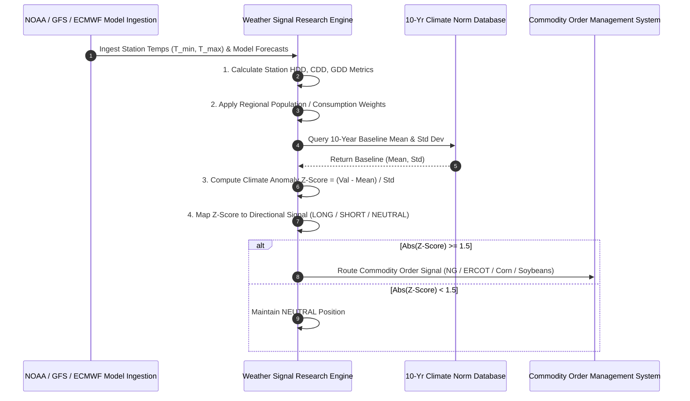

# Institutional Weather Data Signal Research Workflows

## Workflow 1: Weather Station Data & Model Forecast Processing Pipeline


---

## Workflow 2: GFS vs ECMWF Model Shift Arbitrage Pipeline
```mermaid
flowchart TD
    A[Monitor Model Runs: 00z, 06z, 12z, 18z] --> B[Extract 14-Day Forecast Cumulative GW-HDDs]
    
    B --> C[Compute Model Run Shift: Delta_HDD = HDD_12z - HDD_00z]
    C --> D{Abs(Delta_HDD) >= 10 GW-HDDs?}
    
    D -- No --> E[No Significant Model Revision -> HOLD]
    D -- Yes --> F{Delta_HDD > 0 (Colder Forecast)?}
    
    F -- Yes --> G[Submit Immediate LONG Signal for Natural Gas Futures]
    F -- No --> H[Submit Immediate SHORT Signal for Natural Gas Futures]
    
    G --> I[Execute Order Before Mainstream Media Report Release]
    H --> I
```
