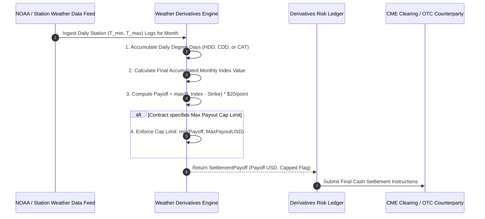

# Institutional Weather Derivatives & Niche Instrument Workflows

## Workflow 1: Monthly CME Weather Contract Accumulation & Cash Settlement


---

## Workflow 2: Burn Analysis Historical Simulation Valuation Pipeline
```mermaid
flowchart TD
    A[Structure OTC Weather Derivative / Swap] --> B[Fetch 20-30 Years Historical Meteorological Station Logs]
    
    B --> C[Calculate Historical Monthly Accumulated Indexes (HDD/CDD)]
    C --> D[Apply Climate Trend Adjustment (Warming Trend detrending)]
    
    D --> E[Compute Contract Payoff for Each Historical Season]
    E --> F[Calculate Mean Expected Payoff & Standard Deviation]
    
    F --> G[Derive Fair Option Premium / Swap Spread]
    G --> H[Export Burn Analysis Audit Report to Risk Committee]
```