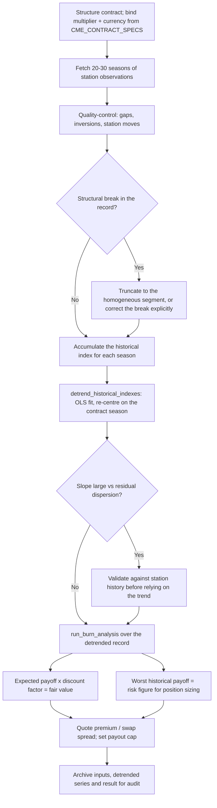
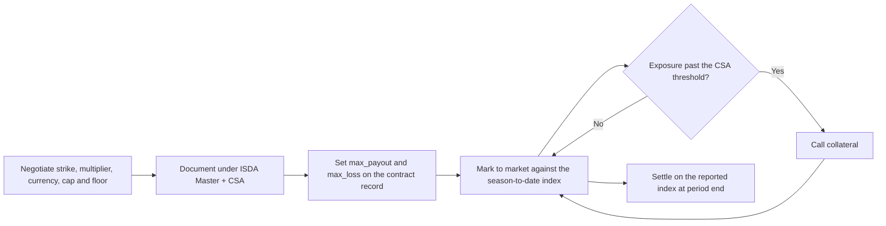

# Weather Derivatives & Niche Instrument Workflows

## Workflow 1: Index accumulation and cash settlement

The engine's index is an **estimate**. Cash settles against the index reported by
Speedwell Settlement Services Ltd on the second Exchange Business Day after the
contract month; a divergence between the two is investigated, not overridden.

```mermaid
sequenceDiagram
    autonumber
    participant Feed as NWS / JMA station observations
    participant Engine as Weather Derivatives Engine
    participant Speedwell as Speedwell Settlement Services
    participant Risk as Derivatives Risk Ledger
    participant Clearing as CME Clearing / OTC counterparty

    Feed->>Engine: Daily (T_min, T_max) for the accumulation period
    Engine->>Engine: 1. Reject non-finite or inverted observations
    Engine->>Engine: 2. T_mean = (T_max + T_min) / 2, midnight-to-midnight
    Engine->>Engine: 3. Accumulate HDD / CDD at the contract base, or CAT unadjusted
    Engine->>Engine: 4. Payoff at the contract multiplier and currency
    note over Engine: futures P&L uses the entry index price,<br/>not the settlement value
    alt Contract carries a payout cap
        Engine->>Engine: 5. Cap gains at max_payout, floor losses at -max_loss
    end
    Engine-->>Risk: SettlementPayoff (gross, final, currency, capped flag)
    Speedwell-->>Risk: Official reported index (T+2 business days)
    Risk->>Risk: 6. Reconcile estimate against reported index
    alt Indexes disagree
        Risk->>Risk: 7. Investigate station data; do NOT settle on the local estimate
    end
    Risk->>Clearing: Cash settlement instruction on the reported index
```

**Decision points.**

1. **A missing station day is not a zero-degree-day day.** `max(0.0, float('nan'))` is
   `0.0` in Python, so an unguarded gap silently lowers the index. Either infill the
   gap explicitly, from a documented correlated-station method, and record that you
   did — or stop. Never let it default.
2. **The base temperature belongs to the contract, not to the code.** 65 °F for CME
   US, 18 °C for CME European HDD. Both produce plausible-looking totals from the same
   data, so a unit mismatch will not announce itself.
3. **CAT may settle negative.** Do not apply a non-negativity check meant for degree
   days to a CAT index.

---

## Workflow 2: Burn analysis valuation



**Decision points.**

1. **Detrend before valuing, not after.** The mean of a raw 20–30 year record sits at
   the midpoint of a warming trend, overstating winter HDD and understating summer
   CDD. Detrend first, then replay the contract.
2. **A fitted slope is not necessarily climate.** A station relocation or an
   instrument change produces the same linear signal. Check the station's documented
   history before smoothing a break into a trend — the correct treatment of a break is
   truncation or an explicit level correction.
3. **Size on the worst realised payoff, not the mean.** For a sold swap the expected
   payoff is the price; the worst season in the record is the exposure. Set the payout
   cap against the latter.
4. **Do not read the empirical 5th percentile as a tail estimate.** With 30 seasons it
   rests on one or two observations. If the tail drives the decision, move to an index
   model or a stochastic temperature model.

---

## Workflow 3: OTC weather swap credit management



An uncapped sold swap is an unbounded loss against a single extreme season. Because a
weather swap has no market-observable underlying to liquidate against, the payout cap
is the primary credit control — collateral is the secondary one. See
`counterparty-credit-risk-for-otc-derivatives`.
