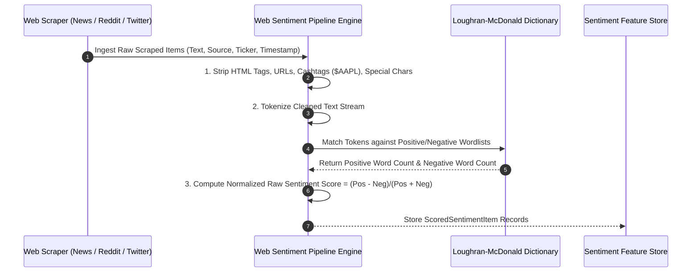

# Institutional Financial Web Sentiment Pipeline Workflows

## Workflow 1: Web Scraping, Text Cleaning, and Lexicon Scoring Pipeline


---

## Workflow 2: Sentiment Anomaly Signal Generation Pipeline
```mermaid
flowchart TD
    A[Fetch Daily Scored Sentiment Items for Ticker] --> B[Calculate Daily Ticker Sentiment Mean S_mean]
    
    B --> C[Fetch 30-Day Rolling Baseline (Mean mu_30d, Std Dev sigma_30d)]
    C --> D[Calculate Sentiment Z-Score: Z = (S_mean - mu_30d) / sigma_30d]
    
    D --> E{Abs(Z-Score) >= 1.5?}
    
    E -- No --> F[Output NEUTRAL Signal]
    E -- Yes --> G{Z-Score >= +1.5?}
    
    G -- Yes --> H[Output LONG Signal for Target Ticker]
    G -- No --> I[Output SHORT Signal for Target Ticker]
    
    H --> J[Pass Signal & Confidence Score to Trading Portfolio]
    I --> J
```
