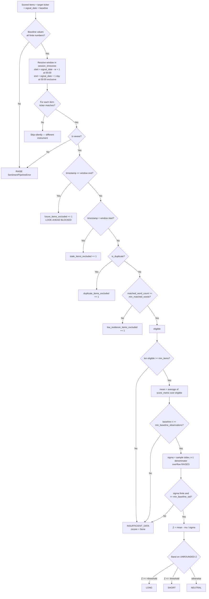

# Web-Scraped Sentiment Pipeline — Procedures

## Workflow 1: Ingest, clean and score

```mermaid
sequenceDiagram
    autonumber
    participant Scraper as Collector (news / EDGAR / social)
    participant Engine as Sentiment Pipeline Engine
    participant Lexicon as LM word lists
    participant Store as Feature store

    Scraper->>Engine: RawScrapedItem(item_id, source, tz-aware timestamp, ticker, text)
    Engine->>Engine: Validate — naive timestamp / bad ticker / non-string text RAISES
    Engine->>Engine: 1. Remove script+style BODIES (closed and unclosed), then tags
    Engine->>Engine: 2. Unescape HTML entities to a fixed point, re-strip revealed markup
    Engine->>Engine: 3. Remove URLs (http/https and bare www.)
    Engine->>Engine: 4. Strip punctuation, split underscores, lowercase, collapse whitespace
    Engine->>Lexicon: Match tokens, flipping polarity within 3 tokens after a negator
    Lexicon-->>Engine: positive_count, negative_count, negated_matches
    Engine->>Engine: 5. polarity = (P-N)/(P+N); lm_tone = (P-N)/tokens
    Engine->>Engine: 6. Mark near-duplicates on (ticker, cleaned text), keeping the EARLIEST
    Engine-->>Store: ScoredSentimentItem — one record per input, duplicates flagged not deleted
```

**Ordering matters and is not interchangeable.**

1. `<script>`/`<style>` **bodies** go before tag stripping. Strip tags first and the JavaScript
   survives as prose; identifiers and string literals then tokenize into the lexicon. The
   **unclosed** case is handled too: a truncated scrape ends mid-element, and stripping only the
   opening tag spills the body into the tokens.
2. Entity unescaping goes before punctuation removal — the other order turns `&amp;` into the
   token `amp` in every article that uses an ampersand — and runs to a **fixed point** (bounded
   at 4 passes), because scraped pages are routinely double-escaped: a CMS escaping content that
   was already escaped emits `&amp;amp;`, which one pass leaves as `amp` just as no pass would.
3. Unescaping can *reveal* markup (`&lt;script&gt;`), so scripts and tags are stripped once more
   afterwards.
4. URL removal goes before punctuation removal, or a URL shatters into a dozen junk tokens.
5. Underscores are split explicitly: `\w` includes `_`, so `record_loss` would otherwise survive
   as one unmatched token.

---

## Workflow 2: Point-in-time aggregation and signal generation



### The cutoff

`window_end` is midnight at the **start of the day after** `signal_date`, in `session_timezone`,
and the comparison is `>=`, so `signal_date` 23:59:59 is in and 00:00:00 the next day is out.

`signal_date` is a **cutoff, not a label**. The most common way this pipeline produces an
untradeable backtest is a loop that scores the whole corpus once and then calls
`generate_ticker_signals` per day with the full list. Without a cutoff every day's signal reads
the entire history, including documents published after the decision it simulates.

The timezone is not cosmetic. A document stamped `2026-03-11T00:00:00Z` is:

- **outside** the 10 March window under `session_timezone=UTC` (excluded as future), and
- **inside** it under `session_timezone=UTC-4`, where it is 20:00 on 10 March.

Set `session_timezone` to the session your strategy trades, then leave it fixed. Changing it
retroactively re-dates every historical document and silently rewrites the backtest.

### Reading the counters

Exclusion counters are the audit record. Interpret them:

| Reading | What it means | Action |
| :--- | :--- | :--- |
| `future_items_excluded` consistently 0 in a backtest | Either the corpus is genuinely pre-cutoff, or the cutoff never bit | Confirm the corpus extends past `signal_date`. Zero is not proof of correctness. |
| `future_items_excluded` large and steady | The cutoff is doing its job | None — this is the control working |
| `duplicate_items_excluded` >> 0 on news | Heavy syndication | Expected. Verify the survivor is the earliest copy |
| `low_evidence_items_excluded` dominant | Corpus is off-domain for the lexicon | Load the full dictionary, or reconsider the source |
| `stale_items_excluded` large | Window narrower than the collection cadence | Widen `aggregation_window_days` deliberately, not reflexively |

### The baseline

The baseline is the caller's responsibility and the engine cannot validate its **units** — only
its finiteness and its length. Build it as: for each of the preceding $n$ sessions, run this same
pipeline with this same configuration and collect `current_sentiment_mean`. Anything else —
per-document scores, a different window, a different lexicon, a different `min_matched_words` —
puts a different distribution in the denominator and produces a Z-score that looks valid and
means nothing.

Rebuild the baseline whenever the lexicon or any gate changes. A configuration change is a units
change.

---

## Workflow 3: Loading the full dictionary

The bundled lists are a verified 80/140 subset of a 354/2,355 dictionary. For anything past a
smoke test:

```python
positive, negative = load_lm_lexicon_from_master_dictionary(
    "Loughran-McDonald_MasterDictionary_1993-2024.csv"
)
engine = WebScrapedSentimentPipelineEngine(
    positive_words=positive,
    negative_words=negative,
    exclude_filing_specific_terms=True,   # False when the corpus IS filing text
)
```

The loader reads category membership from the `Positive` and `Negative` columns, where a non-zero
value is the year the word entered that category. It raises if either column is missing or either
list comes back empty — a silently empty lexicon scores every document 0.0 and reports a
perfectly calm `NEUTRAL` forever.

**Pin the dictionary version.** SRAF updates it annually. Swapping releases mid-study changes the
feature and invalidates the baseline; treat the dictionary file as versioned research input and
record which release produced a given backtest — see `data-lineage-tracking-for-audit-and-debugging`.

**Check the licence** before a commercial deployment: the materials are published free for
academic research, with commercial users directed to contact the authors.

---

## Workflow 4: Failure modes and responses

| Failure | Symptom | Response |
| :--- | :--- | :--- |
| Collector backfilled timestamps | Every document lands on its scrape date, not publication | Reject the corpus. Publication time is the only valid point-in-time stamp |
| Lexicon swapped without rebuilding the baseline | Z-scores shift regime with no market cause | Rebuild the baseline from the new configuration |
| Per-document baseline supplied | Every Z muted by roughly $\sqrt{n}$; signals never fire | Rebuild from daily aggregates. The engine cannot detect this |
| Constant baseline (a dead ticker) | `INSUFFICIENT_DATA`, `baseline_std is None` | Correct behaviour. Do not substitute a $\sigma$ |
| `None` coerced to 0 downstream | `INSUFFICIENT_DATA` renders as a flat, tradeable NEUTRAL | Fix the consumer. `None` must render as "not measurable" |
| Rewritten syndicated copy | Duplicates survive text-identity dedup | Add MinHash/shingled Jaccard upstream; not implemented here |
| Near-constant baseline (a dormant ticker) | `INSUFFICIENT_DATA`, `baseline_std is None` | Correct. Do not lower `min_baseline_std` to force a signal |
| Baseline values far outside $[-1,+1]$ | `SentimentPipelineError` on dispersion overflow | The baseline is not this pipeline's aggregate. Rebuild it |
| Coordinated posting campaign | Many distinct authors, distinct text, one narrative | Out of scope — no author metadata. Use `social-media-sentiment-signal-with-bot-filtering` |
