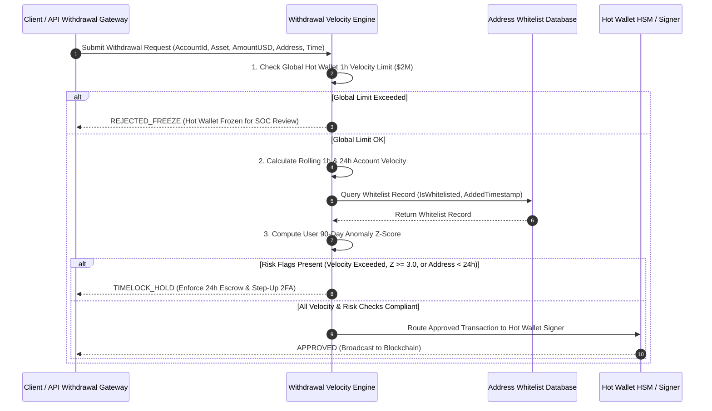

# Institutional Withdrawal Velocity & Security Workflows

## Workflow 1: Pre-Disbursement Velocity & Anomaly Evaluation Pipeline


---

## Workflow 2: Global Hot Wallet Circuit Breaker Incident Pipeline
```mermaid
flowchart TD
    A[Global Hot Wallet 1h Velocity Breaches Threshold] --> B[Trigger REJECTED_FREEZE Decision]
    
    B --> C[Immediately Pause Automated Hot Wallet Signer Service]
    C --> D[Dispatch PagerDuty Incident Alert to Security Operations Center]
    
    D --> E[Isolate Compromised Account / API Keys]
    E --> F[Conduct Hot Wallet Ledger & On-Chain Audit]
    
    F --> G{Security Incident Resolved?}
    
    G -- Yes --> H[Manual Multi-Sig Reset of Hot Wallet Circuit Breaker]
    G -- No --> I[Maintain Hot Wallet Freeze & Evacuate Funds to Cold Storage]
    
    H --> J[Resume Automated Disbursement Queue]
```
