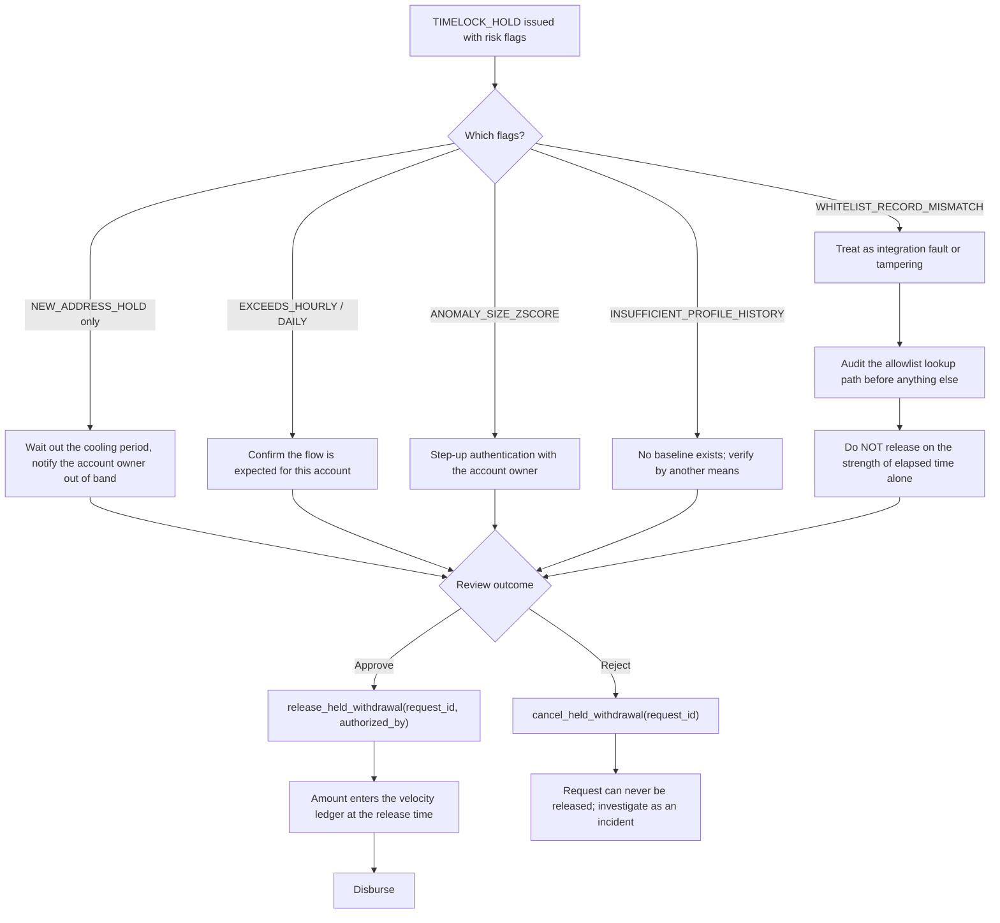
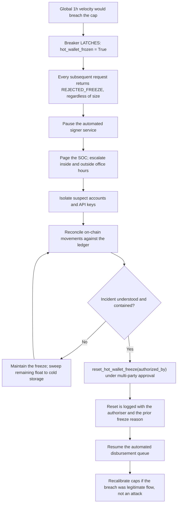

# Withdrawal Velocity & Anomaly Detection — Procedures

## Workflow 1: Pre-disbursement evaluation pipeline

The ordering matters. The latch is checked before the cap, the record is bound
before its age is measured, and the profile is validated before it is trusted.

```mermaid
sequenceDiagram
    autonumber
    participant Client as Withdrawal Gateway
    participant Engine as WithdrawalVelocityEngine
    participant Clock as Trusted Clock
    participant Signer as Hot Wallet Signer

    Client->>Engine: evaluate_withdrawal_request(req, record, profile, evaluation_timestamp)
    Engine->>Clock: read trusted now (never req.timestamp)
    Engine->>Engine: 0. Replay cache hit on request_id?

    alt Known request_id
        Engine-->>Client: Original decision replayed (idempotent)
    else New request
        Engine->>Engine: Validate amounts finite and positive; skew-check req.timestamp

        alt Breaker already latched
            Engine-->>Client: REJECTED_FREEZE (awaiting manual reset)
        else Breaker armed
            Engine->>Engine: 1. Global hot wallet 1h velocity + amount > global cap?

            alt Global cap breached
                Engine->>Engine: LATCH freeze, record reason and time
                Engine-->>Client: REJECTED_FREEZE (SOC page, queue halted)
            else Within global cap
                Engine->>Engine: 2. Account rolling 1h / 24h velocity
                Engine->>Engine: 3. Z-score, or flag INSUFFICIENT_PROFILE_HISTORY
                Engine->>Engine: 4. Bind record to (account, address), then check age

                alt Any risk flag
                    Engine->>Engine: Park request awaiting review
                    Engine-->>Client: TIMELOCK_HOLD + flags
                else Clean
                    Engine->>Engine: Append to ledger stamped with trusted clock
                    Engine-->>Signer: APPROVED
                end
            end
        end
    end
```

## Workflow 2: Disposition of a held withdrawal

A hold is not a decision — it is a deferral, and both exits must be taken
explicitly. A hold left in `_held_requests` forever is a stuck customer
withdrawal; a hold released without `release_held_withdrawal` is an unmetered
hole in every rolling cap.



## Workflow 3: Global hot wallet freeze and recovery



## Procedure: calibrating the caps

Do not start from the defaults. They are placeholders (see
`references/standards.md` §2).

1. **Measure before you limit.** Pull 90 days of withdrawal history and compute,
   per account tier, the rolling 1h and 24h USD totals. Plot the distribution.
2. **Set the account caps above routine flow, below ruin.** A cap below the 99th
   percentile of legitimate behaviour generates holds your review team cannot
   clear; a cap above the account's plausible balance protects nothing.
3. **Set the global cap from loss tolerance, not from the sum of account caps.**
   Ask: how much may leave the hot wallet in one hour before that is an
   unrecoverable incident? The sum of per-account caps is usually far larger than
   this — that gap is precisely why the global breaker exists.
4. **Size the hold period against your review SLA.** A 24h hold with a 72h review
   queue is a 72h hold that lies to the customer.
5. **Re-derive the profiles on a lag.** Compute `mu`/`sigma` from a window that
   ends before the current evaluation window, and exclude previously flagged
   amounts, so an attacker's own activity cannot drag the baseline toward itself.
6. **Rehearse the freeze.** Trip the breaker in a staging environment and time
   the path to `reset_hot_wallet_freeze`. A breaker nobody has ever reset is an
   untested outage.

## Procedure: operating the engine safely

- **Persist the ledger.** The in-memory ledger zeroes every rolling window on
  restart. Back it with durable storage and reload the last 24 hours at startup,
  or a crash loop becomes a withdrawal window.
- **Serialise evaluate-then-submit.** The engine is not thread-safe. Two
  concurrent evaluations both read a pre-update ledger and can each approve an
  amount that only one of them had capacity for.
- **Pass `evaluation_timestamp` explicitly** in tests, replays, and audits.
  Defaulting to wall-clock time makes decisions unreproducible.
- **Alert on `decision.warnings`, not just on flags.** Persistent clock skew and
  repeated `INSUFFICIENT_PROFILE_HISTORY` are integration problems that quietly
  degrade the anomaly layer.
- **Treat `anomaly_zscore is None` as "did not run".** It is not a pass, and a
  dashboard that renders it as 0.0 is reporting a check that never happened.
