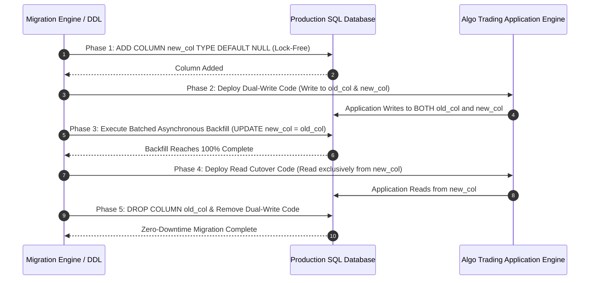

# Institutional Zero-Downtime Migration Workflows

## Workflow 1: 5-Phase Expand-Contract Migration Sequence


---

## Workflow 2: Asynchronous Batched Backfill Execution Pipeline
```mermaid
flowchart TD
    A[Initiate Phase 3 Backfill Job] --> B[Fetch Unpopulated Batch (WHERE new_col IS NULL LIMIT 1000)]
    
    B --> C{Rows Remaining?}
    
    C -- No --> D[Backfill 100% Complete -> Signal Ready for Phase 4 Cutover]
    C -- Yes --> E[Execute UPDATE table SET new_col = old_col WHERE id IN batch]
    
    E --> F[Check Read Replica Replication Lag]
    F --> G{Replication Lag > 1.0s?}
    
    G -- Yes --> H[Throttle / Pause Backfill Engine for 5 Seconds]
    G -- No --> I[Increment Backfilled Counter & Sleep 100ms]
    
    H --> B
    I --> B
```
