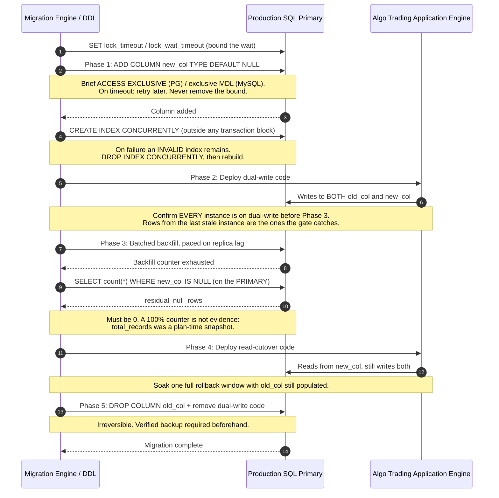
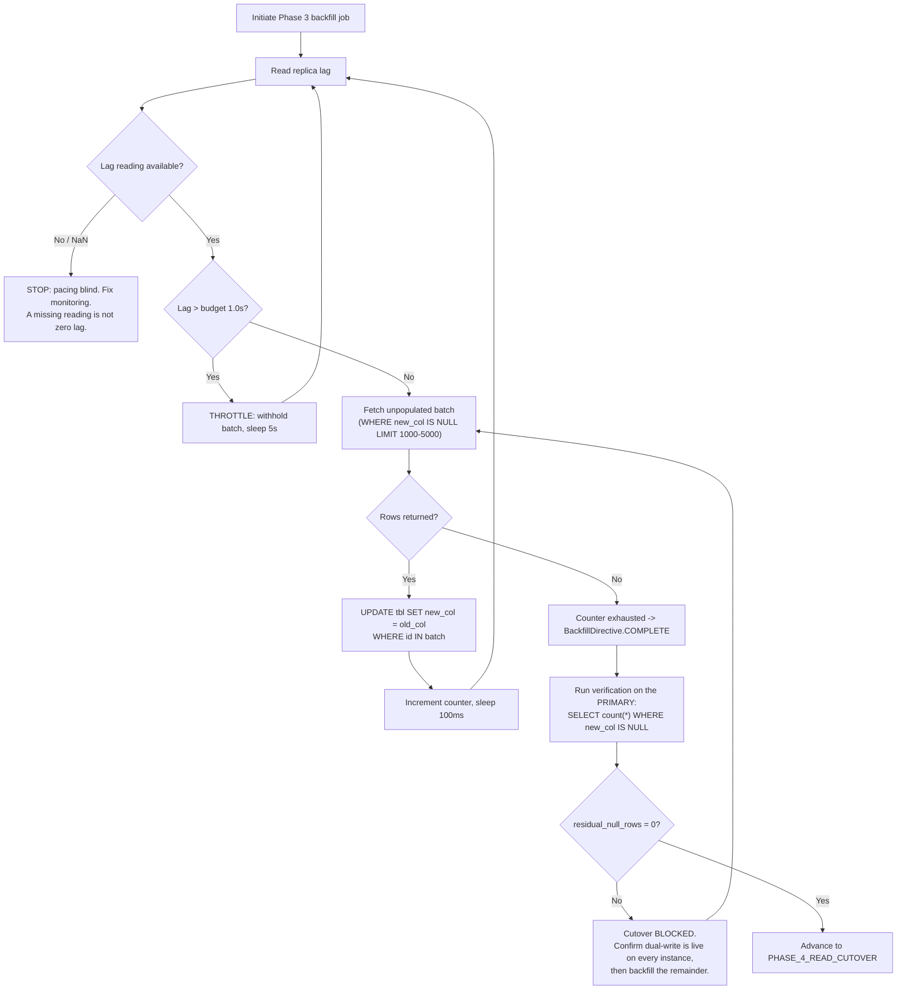
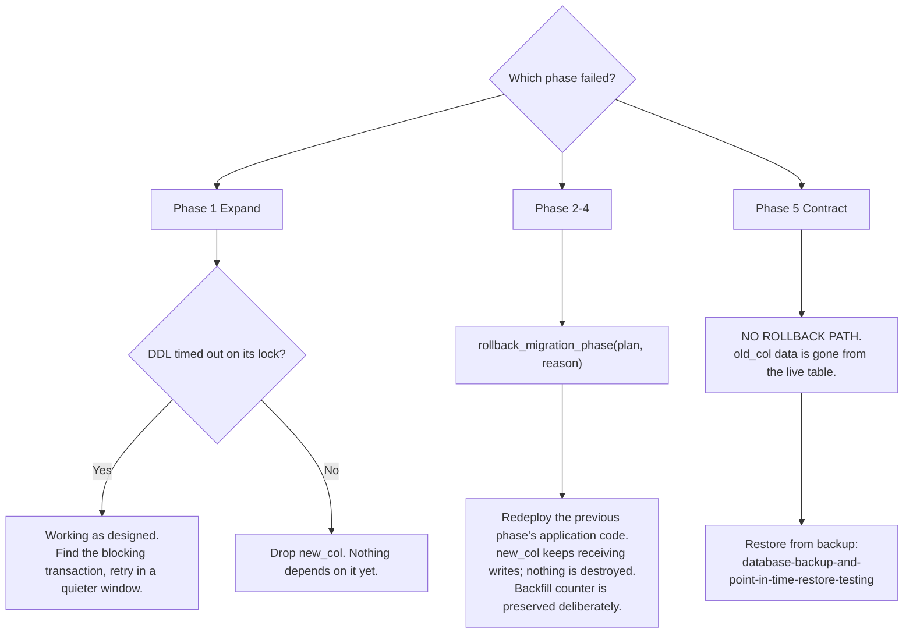
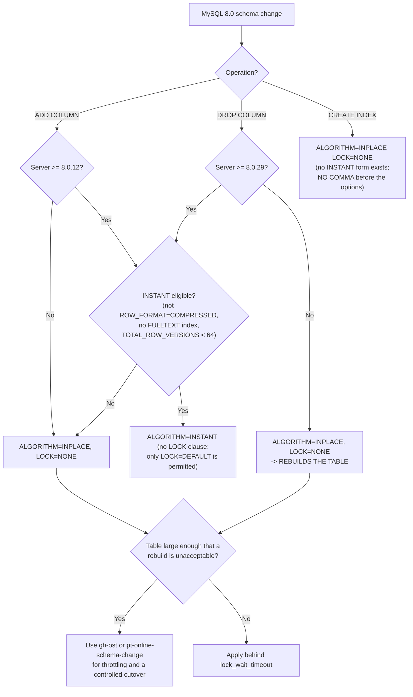

# Institutional Zero-Downtime Migration Workflows

## Workflow 1: 5-Phase Expand-Contract Migration Sequence

---

## Workflow 2: Asynchronous Batched Backfill Execution Pipeline

The order matters: lag is checked **before** the batch is applied, not after. Applying the
batch and then pausing means the batch that pushed lag over budget has already been sent.

---

## Workflow 3: Failure and Rollback Decision Tree

**Why Phases 2-4 are cheap to reverse and Phase 5 is not.** Through Phase 4 both columns are
populated and both are readable, so reverting is a code deploy. Phase 5 removes that
redundancy. This is why the soak in step 8 of the workflow exists: it is the last window in
which a bug in the new read path costs a deploy rather than a restore.

---

## Workflow 4: MySQL Algorithm Selection

